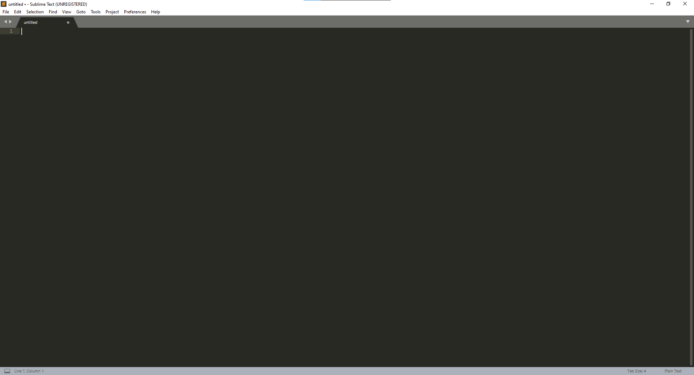
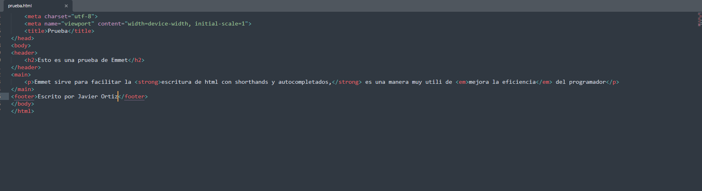
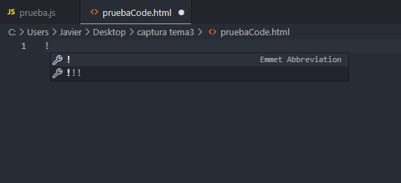
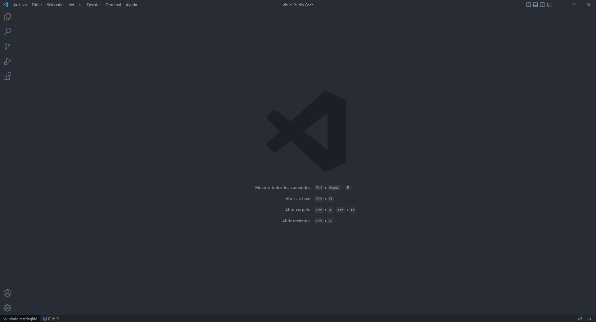
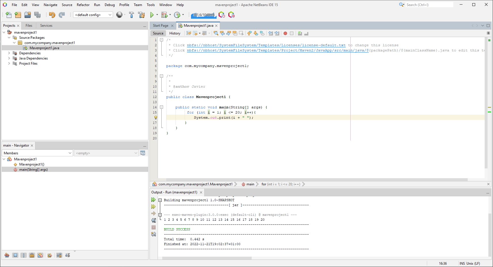
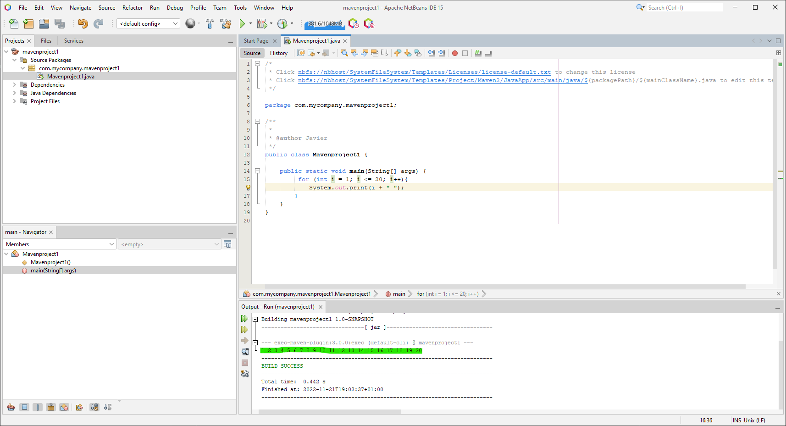
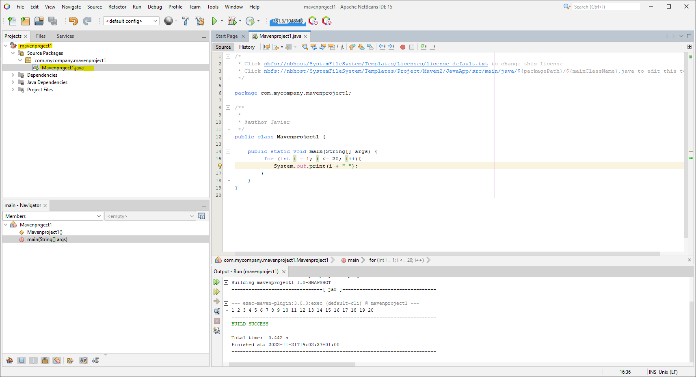
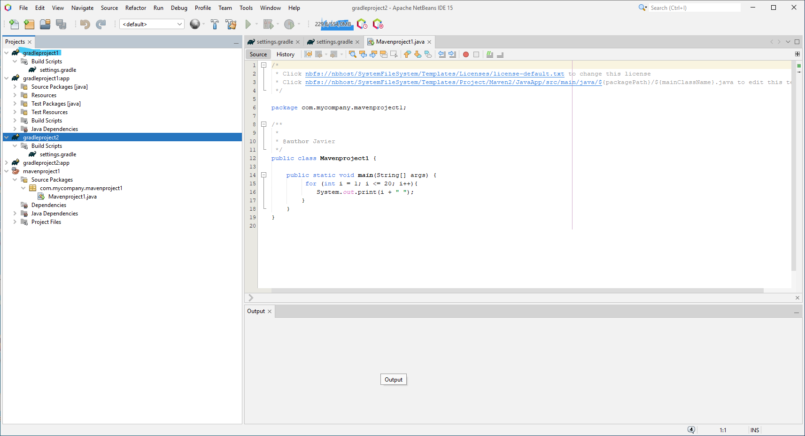

# [Entornos integrados de desarrollo](http://jamj2000.github.io/entornosdesarrollo/2/actividades#indice)

### 1. Instala el editor sublime text. Saca una captura de pantalla una vez instalado. ###

### 2. Personaliza Sublime text instalando los complementos más importantes.###

Consulta la página https://www.genbetadev.com/desarrollo-web/10-packages-de-sublimetext-para-desarrolladores-web

BracketHighlighter

HTML5

Terminal

JavaScriptNext ES6

PackageDev

Emmet

SideBarEnhancements

HTML-CSS-JS Prettify

Color Highlighter

***estos son los paquetes que creo más interesantes***

------

### 3. ¿Para que sirve el complemento **Emmet**? Haz uso de él al escribir un archivo html de prueba.###

Es una ayuda para codificar mucho más rápido y de manera mas eficiente, podemos en las dos capturas siguientes:

En sublime como a puesto todo el esqueleto de HTML solo con la etiqueta *<html>*. Y en Code se utiliza *!*

*sublime:*

*En Code:*

------

### 4. Instala el editor Visual Studio Code. Saca una captura de pantalla una vez instalado y funcionando.###

------

### 5. Haz una comparativa de la funcionalidad ofrecida por Sublime text y la ofrecida por Visual Studio Code referente a los siguientes aspectos:

|             Aspecto             | Sublime                                                      | Code                                                         |
| :-----------------------------: | ------------------------------------------------------------ | ------------------------------------------------------------ |
|       Terminal Integrado        | No trae terminal integrado, hay que ponerle el plugin.       | Trae terminal integrado, no hace falta ningún plugin.        |
|        Emmt incorporado         | En sublime hay que descargarlo, ayuda a la codificación con comandos de texto haciéndonos más productivos | Si trae Emmet incorporado,  ayuda a la codificación con comandos de texto haciéndonos más productivos |
|        Iconos Archivos.         | Hay que descargarse el paquete para poder ver los iconos de los archivos | Con Code no hace falta ningún paquete, y es fácil de interpretar la navegación por archivos y los iconos son fáciles de interpretar. |
|        Atajos de teclado        | Con Sublime podemos designar para comentar y descimentar la combinación de teclas de ctrl +7 | En Code podemos designar para comentar y descimentar la combinación de teclas de ctrl +ç |
| Atajo para buscar y seleccionar | En sublime es ctrl+D para seleccionar y ctrl+F para buscar   | En Code ctrl+D Para seleccionar un fragmento del codigo y se añade a la búsqueda de manera automática |

------

### 6. ¿Qué paquetes básicos debemos instalar en Ubuntu para desarrollar en Java?

Uno de los JKD que nos descarguemos, yo uso indistintamente el 17,18 y 19.

------

### 7.Instala el entorno integrado Netbeans. Saca una captura de pantalla una vez instalado y funcionando.

------

### 8.Crea un proyecto en Java en Netbeans. Realiza su compilación y ejecución.

------

### 9. ¿Qué sistema de construcción utiliza Netbeans para generar los archivos "ejecutables"? Mira en el directorio raíz del proyecto y examina qué *buildfile* utiliza de los vistos en el tema.

Se puede crear proyectos con Maven y con Gradel, se muestra en los dos pantallazos siguientes:

*Netbeans con Maven:*

*Netbeans con Gradel:*

