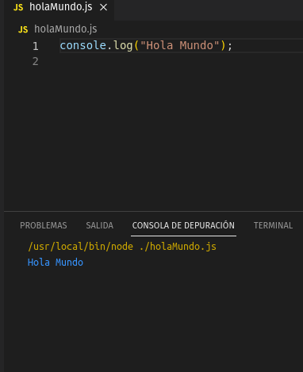

# Herramientas de desarrollo

### 1. Ejecuta el programa "Hola mundo" en los siguientes lenguajes:

1. 

2. 

3. 

4. 

5. 

   

​					

### 2. Para cada uno de los lenguajes anteriores, indica el proceso realizado  para conseguir ejecutar el código: ¿compilación o interpretación?

**bash:** Compilación

**python:** Compilación

**php:** Compilación

**javascript:** Interpretación

**c:** Compilación

**c++:** Compilación

**java:** Mixto, este caso es un poco raro ya que tiene que levantar una maquina virtual que interpreta el código para después compilarlo 

**ensamblador:** Compilación 

**ruby:** Interpretación

**go:** Compilación

**rust:** Compilación

**lisp:** Compilación

### 3. Para cada uno de los lenguajes anteriores, indica el nombre del compilador o interprete utilizado en GNU/Linux.

**bash:** interpretado, en si es un interprete en linea de comando, el nombre es un juego de palabras que viene de **B**ourne-**a**gain **sh**ell. 

**python:** Compilación, CPython 

**php:** Compilación, JIT compiler

**javascript:** Interpretación, cualquier navegador.

**c:** Compilación, GCC copilator

**c++:** Compilación, GCC copilator

**java:** Mixto, este caso es un poco raro ya que tiene que levantar una maquina virtual que interpreta el código para después compilar. *GNU Compiler for Java*  (**GCJ**)

**ensamblador:** Compilación,  *Gas*.

**ruby:** Interpretación, [JRuby](http://jruby.org) es Ruby encima de la JVM (Máquina Virtual Java)

**go:** Compilación (no encuentro el nombre, se instala con el propio lenguaje. Documentación de google)

**rust:** Compilación, creo que es Rustc.

**lisp:** Compilación, **GNU Common Lisp** (GCL)

### 4.Investiga y averigua que extensión tienen los archivos de código fuente de los siguientes lenguajes:

**bash:** *.sh*

**python:** *.py*

**php:** *.php*

**javascript:** *.js*

**c:** *.c*

**c++:** *.cpp*

**java:** *.java*

**ensamblador:** *.jasm*

**ruby**: *.rb*

**go:** *.go*

**rust:** *.rs*

**lisp:** *.lisp*

### 6. ¿Qué extensión tienen los archivos de código objeto?

*En [programación](https://es.wikipedia.org/wiki/Programación), se llama código objeto al código que resulta de la [compilación](https://es.wikipedia.org/wiki/Compilación) del [código fuente](https://es.wikipedia.org/wiki/Código_fuente).[1](https://es.wikipedia.org/wiki/Código_objeto#cite_note-1) Puede ser en lenguaje máquina o bytecode, y puede distribuirse en  varios archivos que corresponden a cada código fuente compilado*

 **bash:** *.sh*

**python:** *.py*

**php:** *.php*

**javascript:** *js*

**c:** *no tienen extension*

**c++:** *no tienen extension*

**java:** *no tienen extension*

**ensamblador:** *.asm 

**ruby**: *no tienen*

**go:** *no tiene extension*

**rust:** *No tienen*

**lisp:** *.lisp*

### 7. Lenguaje C. Código en varios archivos. Obtener el código objeto a partir del código fuente de los 3 archivos siguientes:

​	**a.** 

**b.** 

------

### 8. Lenguaje C. Código en varios archivos. Obtener el código binario  ejecutable a partir del código objeto de los 3 archivos anteriores:

**a.** 

### 11. Bibliotecas. Define que se entiende por biblioteca o librería y los tipos que existen.

Son un conjunto de archivos objeto o código fuente que nos ayudan a la hora de programar, hacen que nuestros programas tengas más funcionalidades. Hay muchos tipos de bibliotecas, o librerías, par texto o temas matemáticos, tratamiento de imágenes etc... El termino librería es un termino que esta mal usado pero muy extendido ya que viene del ingles Librery. Que la traducción sería biblioteca.

Dicho esto para hacerlo más fácil hablaremos de bibliotecas estándar del lenguaje y bibliotecas adicionales.

------

### 12. Bibliotecas. ¿Qué tipo es el más utilizado actualmente? ¿Por qué?

Es más común el uso de bibliotecas dinámicas para la funcionalidad  básica, y el uso de plugins se deja para la funcionalidad opcional.

